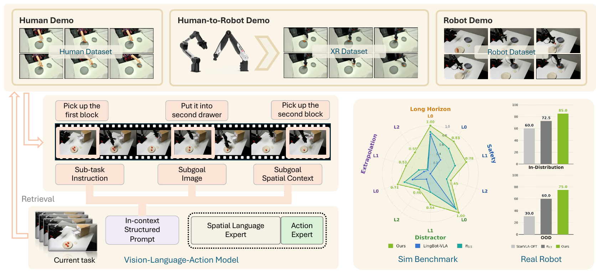
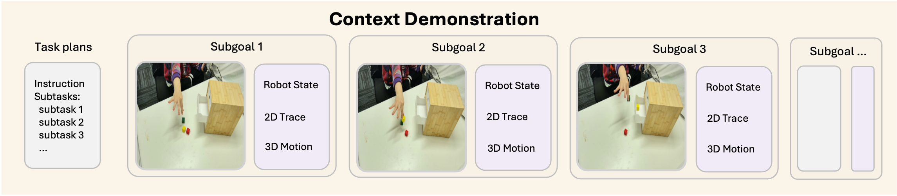
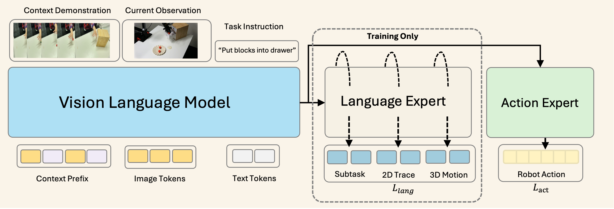

<div align="center">
  
  <h1>StellaVLA: In-Context Structured Demonstration for Generalizable Vision-Language-Action Models</h1>
</div>

<p align="center">
  <a href="https://www.stelledge.com/blog/stellavla">
    
  </a>
  <a href="https://arxiv.org/abs/2608.11671">
    
  </a>
  <a href="https://huggingface.co/StellarEdge/StellaVLA">
    
  </a>
  <a href="https://hub.docker.com/r/siyuhsu/stellavla">
    
  </a>
  <a href="https://vla-arena.github.io/#leaderboard">
    
  </a>
  <a href="LICENSE">
    
  </a>
</p>

StellaVLA is a vision-language-action model that uses structured demonstrations as in-context examples for robot manipulation. At test time, it retrieves a demonstration from a related task and uses its high-level plan and grounded motion information to guide the current task, which allows StellaVLA to adapt to new objects, scenes, and language instructions without fine-tuning. Each demonstration is automatically converted into a structured context containing sub-goal descriptions, image-grounded 2D traces, and verbalized 3D workspace motion, without requiring additional human annotation. This repository provides the evaluation code, pretrained checkpoints, and Docker environment needed to reproduce our results on LIBERO, LIBERO-Plus, and VLA-Arena.

<p align="center">
  
</p>

## 🔥 News

- **2026-09-01:** Released evaluation code, checkpoints, and the Docker environment.
- **2026-08-01:** StellaVLA ranked **#1 on VLA-Arena**, with an overall score of **0.63**.

## ✨ Highlights

- **In-context adaptation.** Adapt to a new task from one retrieved demonstration.
- **No test-time adaptation.** No fine-tuning, adapters, or optimization at inference time.
- **Structured demonstrations.** Demonstrations are represented as sub-goals, 2D traces, and 3D workspace motion rather than raw trajectories.
- **No manual annotation.** Structured contexts are generated automatically, offline.
- **Fast inference.** One control step takes ~88 ms with demonstration KV caching.
- **Three benchmarks, one image.** Reproduce LIBERO, LIBERO-Plus, and VLA-Arena from a single Docker image.

## 🚀 Quick Start

### Docker

The image ships all three simulators and the policy server, and is the quickest way to
reproduce the reported results.

```bash
docker pull siyuhsu/stellavla:eval

mkdir -p data
docker run --rm --gpus all -v $PWD/data:/data siyuhsu/stellavla:eval fetch-assets
docker run --rm --gpus all -v $PWD/data:/data siyuhsu/stellavla:eval verify

DOCKER="docker run --rm --gpus all --shm-size=16g -v $PWD/data:/data siyuhsu/stellavla:eval"
$DOCKER libero        # 4 suites × 10 tasks × 50 trials
$DOCKER libero-plus   # 9,430 perturbed episodes
$DOCKER vla-arena     # 11 suites × 3 levels
```

Results are written under `/data`. See [`docker/README.md`](docker/README.md) for the
environment layout, device selection, single-suite runs, and build arguments.

### Native installation

The policy server and each simulator live in separate environments.

```bash
conda create -n stellavla python=3.10 -y && conda activate stellavla
pip install torch==2.6.0 torchvision==0.21.0
pip install -r requirements.txt && pip install -e .
```

Install each simulator from its own repository, at the commit the results were measured
on: [LIBERO](https://github.com/Lifelong-Robot-Learning/LIBERO/tree/8f1084e3132a39270c3a13ebe37270a43ece2a01),
[LIBERO-Plus](https://github.com/sylvestf/LIBERO-Plus/tree/4976dc30028e805ff8094b55501d532c48fec182),
[VLA-Arena](https://github.com/PKU-Alignment/VLA-Arena/tree/2ddcb003ca17bb850079acdb34fe0281140bd1df).
[`docker/Dockerfile`](docker/Dockerfile) is the authoritative record of the pinned
versions and of the patches each simulator needs, and
[`examples/`](examples/) holds the per-benchmark run scripts.

## 🤗 Models

| Benchmark | Checkpoint | Evaluation |
| --- | --- | --- |
| LIBERO | 🤗 [`StellarEdge/StellaVLA`](https://huggingface.co/StellarEdge/StellaVLA) → `libero/` | LIBERO, and LIBERO-Plus zero-shot |
| VLA-Arena | 🤗 [`StellarEdge/StellaVLA`](https://huggingface.co/StellarEdge/StellaVLA) → `vla-arena/` | L0 / L1 / L2 |

**Training.** Both models use [Qwen3-VL-4B-Instruct](https://huggingface.co/Qwen/Qwen3-VL-4B-Instruct)
as the backbone. We train separate checkpoints for LIBERO and VLA-Arena, without an
additional robotics pre-training stage. Each model is trained for 30K steps with a global
batch size of 128 on 4×H200 GPUs.

## 📊 Results

### LIBERO

In-distribution success rate (%), 500 rollouts per suite. Baseline numbers are as reported
in the original papers, except StarVLA-OFT, our matched demonstration-free control.

| Method | Spatial | Object | Goal | Long | Avg. |
| --- | ---: | ---: | ---: | ---: | ---: |
| MemoryVLA | 98.4 | 98.4 | 96.4 | 93.4 | 96.7 |
| ACoT-VLA | 99.4 | **99.6** | 98.8 | 96.0 | 98.5 |
| AVA-VLA | 99.2 | **99.6** | 97.9 | 96.2 | 98.2 |
| StarVLA-OFT | 97.8 | 98.6 | 96.2 | 93.8 | 96.6 |
| CogVLA | 98.6 | 98.8 | 96.6 | 95.4 | 97.4 |
| Retrieval-VLA | 97.4 | 98.8 | 96.3 | 89.5 | 95.5 |
| DreamVLA | 97.5 | 94.0 | 89.5 | 89.5 | 92.6 |
| **StellaVLA** | **99.6** | 99.0 | **99.6** | **96.8** | **98.8** |

### LIBERO-Plus

Zero-shot robustness: every model is trained on standard LIBERO and tested on the
perturbed tasks without retraining. Avg. is the task-count-weighted mean over the seven
perturbation categories, excluding Orig.

| Method | Orig. | Cam. | Robot | Noise | Layout | Backg. | Light | Lang. | Avg. |
| --- | ---: | ---: | ---: | ---: | ---: | ---: | ---: | ---: | ---: |
| OpenVLA | 76.5 | 1.1 | 4.1 | 19.3 | 31.6 | 25.3 | 4.4 | 26.8 | 16.0 |
| OpenVLA-OFT | 97.1 | 59.7 | 37.2 | 76.7 | 77.1 | 92.4 | 85.8 | 81.5 | 71.4 |
| π₀ | 94.2 | 15.8 | 6.6 | 79.4 | 70.4 | 78.5 | 79.6 | 61.0 | 53.8 |
| π₀-FAST | 85.5 | 66.4 | 24.8 | 75.8 | 70.3 | 67.7 | 73.0 | 63.3 | 62.5 |
| Nora | 87.9 | 4.0 | 41.1 | 17.6 | 63.9 | 50.5 | 31.0 | 67.0 | 38.7 |
| WorldVLA | 79.1 | 0.3 | 30.2 | 12.2 | 39.4 | 14.5 | 29.4 | 44.2 | 24.3 |
| UniVLA | 95.2 | 4.3 | 50.3 | 25.3 | 34.3 | 80.0 | 59.1 | 71.8 | 44.0 |
| RIPT-VLA | 97.5 | 58.3 | 36.7 | 73.8 | 76.5 | 90.4 | 87.9 | 80.1 | 70.4 |
| StarVLA-OFT | 96.6 | 47.0 | 60.1 | 73.1 | **79.2** | **95.3** | **96.3** | 87.0 | 75.0 |
| **StellaVLA** | **98.8** | **70.5** | **74.8** | **92.8** | 79.3 | 95.2 | 95.7 | **95.3** | **85.1** |

### VLA-Arena

Mean success rate over 11 task suites at three difficulty levels — L0 (in-distribution),
L1 (intermediate generalization), L2 (hardest). Training uses L0 data only. Baselines are
from the [VLA-Arena leaderboard](https://vla-arena.github.io/#leaderboard); the StellaVLA
row is the released checkpoint and demonstration pack, re-measured at seed 7.

| Method | L0 | L1 | L2 | Overall |
| --- | ---: | ---: | ---: | ---: |
| Motus | 0.60 | 0.36 | 0.21 | 0.39 |
| OpenVLA-OFT | 0.77 | 0.29 | 0.14 | 0.40 |
| Evo-Depth | 0.75 | 0.32 | 0.17 | 0.41 |
| π₀.₅ | 0.69 | 0.38 | 0.26 | 0.44 |
| GR00T-N1.6 | 0.50 | 0.24 | 0.09 | 0.28 |
| GR00T-N1.7 | 0.82 | 0.45 | 0.30 | 0.52 |
| LingBot-VLA | 0.91 | 0.39 | 0.23 | 0.51 |
| LingBot-VLA 2.0 | 0.88 | 0.42 | 0.34 | 0.54 |
| DM0.5 | 0.88 | 0.46 | 0.35 | 0.56 |
| **StellaVLA (w/o pretraining)** | **0.88** | **0.64** | **0.52** | **0.68** |

## 🧠 How StellaVLA Works

### Structured demonstration

<p align="center">
  
</p>

Each retrieved demonstration is represented as:

- sub-goal descriptions,
- image-grounded 2D motion traces,
- verbalized 3D workspace motion.

The retrieved demonstration remains fixed throughout an episode, so its KV cache is
computed once and reused across control steps.

### Dual-expert training

<p align="center">
  
</p>

One shared backbone reads `[retrieved demo | current observation | task instruction]`, and
two experts read its hidden states:

| | Trained | Deployed | Objective |
| --- | :---: | :---: | --- |
| Language expert | ✅ | ❌ | CE on the sub-task plan and grounded motion (`lang_w = 0.3`) |
| Action expert | ✅ | ✅ | L1 on the continuous action chunk (`chunk_len = 8`) |

At inference time StellaVLA performs a single VLM forward pass and regresses an 8-step
continuous action chunk directly from the action-token hidden states.

## 📁 Repository Structure

```
stellavla/
  model/framework/stellavla.py    # the model: demo prompt + action head
  model/modules/vlm/QWen3.py      # Qwen3-VL backbone interface
  model/modules/action_model/     # OFT MLP/L1 action head
deployment/model_server/          # WebSocket policy transport
examples/
  LIBERO/eval_files/              # policy server, rollout loop, client adapter
  LIBERO-Plus/eval_files/         # sharded driver and per-dimension aggregation
  VLA-Arena/eval_files/           # policy server and parallel driver
docker/                           # Dockerfile, entrypoint, environment check
```

## 📖 Citation

```bibtex
@article{xu2026stellavla,
  title={StellaVLA: In-Context Structured Demonstration for Generalizable Vision-Language-Action Models},
  author={Xu, Siyu and Wang, Yunke and Wang, Zijian and Zhu, Dihao and Xia, Chenghao and Du, Chengbin and Liu, Daochang and Huang, Tao and Xu, Chang},
  journal={arXiv preprint arXiv:2608.11671},
  year={2026}
}
```

## 🙏 Acknowledgements

StellaVLA is built upon the excellent [StarVLA](https://github.com/starVLA/starVLA) framework. We sincerely thank the StarVLA team for open-sourcing their work and providing a strong foundation for our research.

## 📬 Contact

For questions, collaborations, or support, please contact:

```
{s.xu,yunke.wang}@sydney.edu.au
```

Found a bug or have a feature request? Please open a GitHub issue.
